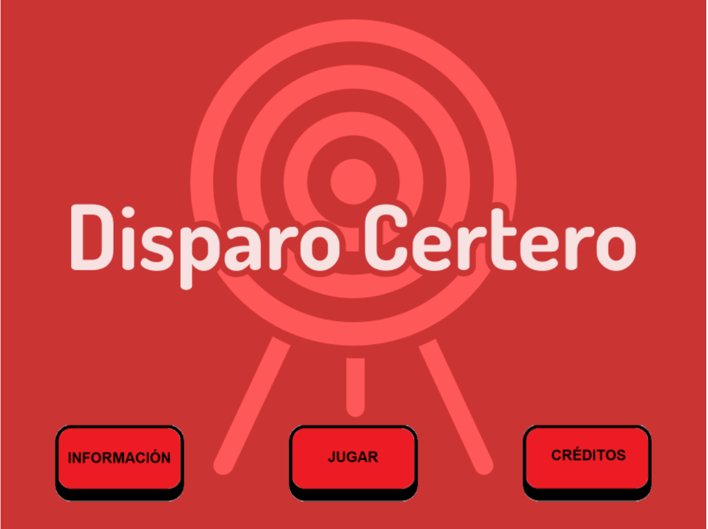
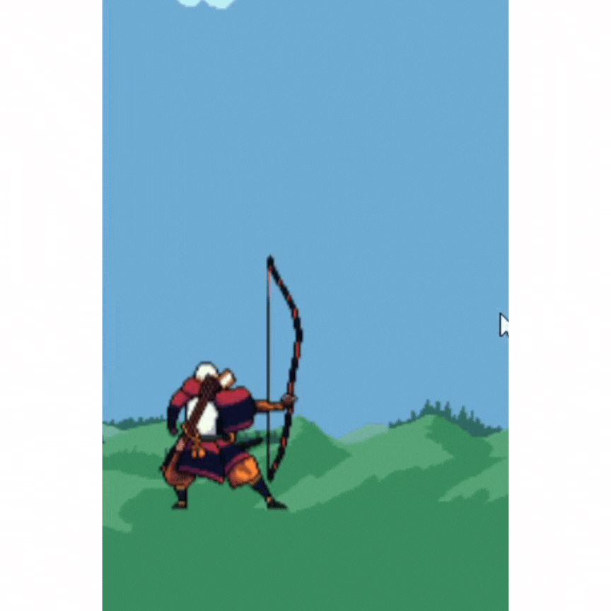

# Disparo Certero

Es un videojuego de estrategia por turnos, en el cual el jugador principal debe realizar un disparo hacia un determinado objetivo (teniendo en cuenta ángulos y potencia).

link del GDD: https://drive.google.com/file/d/11OErud7qzQKNmJwPCRANNpxqXnZW0IlZ/view?usp=drive_link

Link del TDD: https://drive.google.com/file/d/1v7CIJA48Gxusl4R2TLm0-WyRuc4sLIsZ/view?usp=sharing

Universidad Nacional de Rafaela. 
Programación 1.

Santiago Lozan
